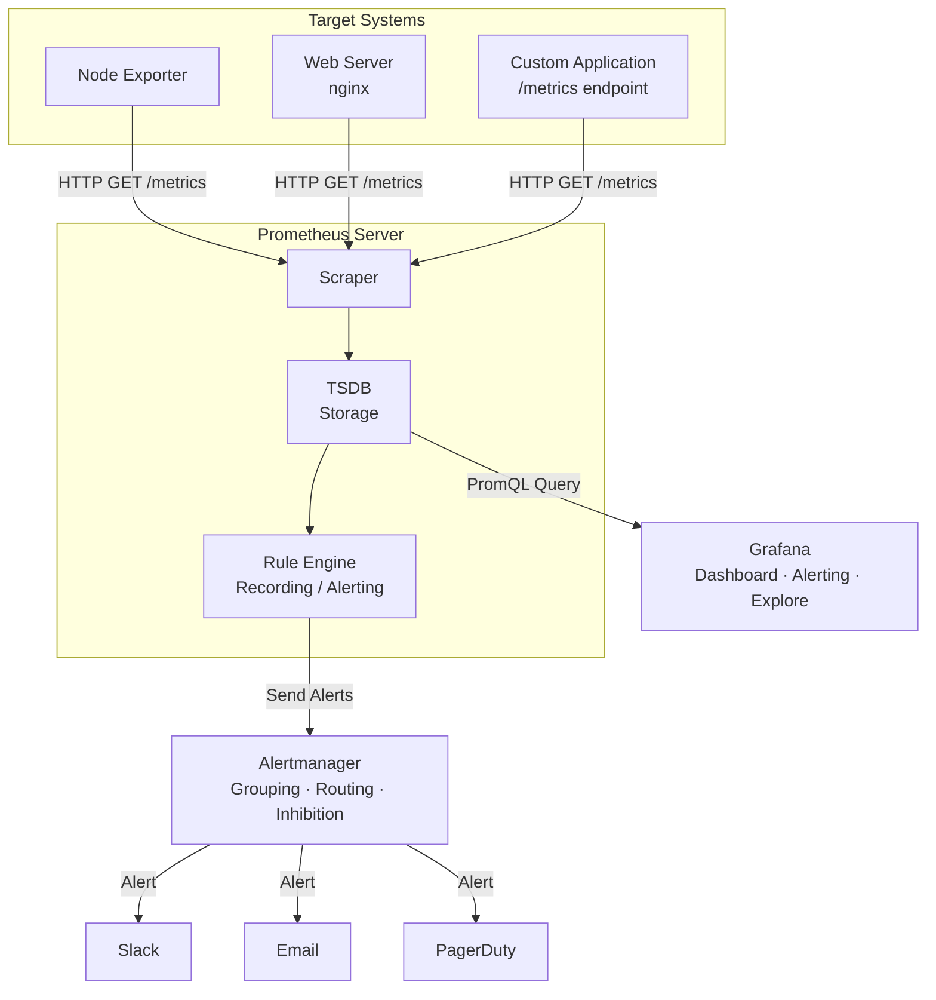

> **Note**: This post is a summary based on the official Prometheus (v3.2.1) and Grafana documentation. For precise details, please refer to the official docs.
> - [Prometheus Official Docs](https://prometheus.io/docs/)
> - [Grafana Official Docs](https://grafana.com/docs/grafana/latest/)

***

## 2.1 Prometheus Components

The Prometheus ecosystem consists of several independent components, most of which are written in Go and distributed as static binaries.

### Prometheus Server

The core component of the system. It performs three main roles.

1. **Scraping**: Fetches metrics from configured targets via HTTP
2. **Storage**: Stores collected metrics in a local time series database (TSDB)
3. **Querying**: Queries and analyzes stored data through PromQL

It also periodically evaluates rules (Recording Rules, Alerting Rules) and sends alerts to Alertmanager when conditions are met.

Default port: **9090**

### Alertmanager

The component that receives and processes alerts sent by the Prometheus Server. It doesn't just forward alerts -- it provides advanced features like:

- **Grouping**: Bundles similar alerts into a single notification. For example, if 100 servers go down simultaneously, it sends one grouped alert instead of 100 individual ones.
- **Inhibition**: Automatically silences lower-level alerts when a higher-level alert fires. If a network failure takes down all services, individual service-down alerts are suppressed.
- **Silences**: Deactivates specific alerts for a defined period. Prevents unnecessary alerts during planned maintenance.
- **Routing**: Routes alerts to appropriate receivers based on labels.

Default port: **9093**

### Push Gateway

An intermediate store for short-lived batch jobs.

In Prometheus's Pull model, the target system must be running for scraping to work. But batch jobs terminate immediately after execution, leaving no opportunity to scrape. Push Gateway solves this problem.

```plain
[Batch Job] --push--> [Push Gateway] <--scrape-- [Prometheus]
```

When a batch job completes, it pushes its results to the Push Gateway, and Prometheus periodically scrapes the Push Gateway.

Default port: **9091**

> **Caution**: Push Gateway is exclusively for batch jobs. Do not use it for collecting metrics from regular services. The official docs make this warning explicit.

### Client Libraries

Libraries used to add metrics (instrumentation) directly in application code.

**Officially supported languages:**

| Language | Library |
| --- | --- |
| Go | `prometheus/client_golang` |
| Java/Scala | `prometheus/client_java` |
| Python | `prometheus/client_python` |
| Ruby | `prometheus/client_ruby` |
| Rust | `prometheus/client_rust` |
| .NET | `prometheus-net` |

Using these libraries, applications expose a `/metrics` endpoint that Prometheus can scrape.

### Exporters

Adapters that expose Prometheus-format metrics from existing systems. Used to monitor third-party systems (databases, web servers, hardware, etc.) where you can't modify the code directly.

**Major Exporters:**

| Exporter | Target | Default Port |
| --- | --- | --- |
| Node Exporter | Linux hosts (CPU, memory, disk, network) | 9100 |
| Blackbox Exporter | HTTP/TCP/DNS endpoint availability | 9115 |
| MySQL Exporter | MySQL servers | 9104 |
| PostgreSQL Exporter | PostgreSQL servers | 9187 |
| cAdvisor | Docker containers | 8080 |
| JMX Exporter | JVM applications (Kafka, Cassandra, etc.) | Configurable |

***

## 2.2 Pull Model vs Push Model

### Pull Model (The Prometheus Way)

Prometheus uses a Pull model where it sends HTTP requests to target systems to fetch metrics.

```plain
[Prometheus Server] --HTTP GET /metrics--> [Target Application]
```

**Pros:**

- **Target health checking**: Scraping itself acts as a health check. If scraping fails, the `up` metric drops to 0, telling you the target is down.
- **Centralized control**: The Prometheus server decides what to collect and how often.
- **Developer convenience**: In development environments, you can access the `/metrics` endpoint directly in your browser to inspect metrics.
- **Firewall-friendly**: Only outgoing connections from the monitoring server to targets are needed.

**Cons:**

- Targets must always be reachable (systems behind NAT are tricky)
- Short-lived targets like batch jobs require a Push Gateway

### Push Model (The Traditional Way)

Systems like StatsD and Graphite use a Push model where targets send metrics to the monitoring server.

```plain
[Target Application] --push--> [Monitoring Server]
```

**Pros:**

- Can monitor systems behind firewalls/NAT
- Natural fit for short-lived jobs

**Cons:**

- Hard to detect target failure immediately (can't distinguish between "metrics aren't arriving" and "not sending metrics")
- Targets need to know the monitoring server's address

### Which Model is Better?

There's no definitive answer. However, Prometheus's Pull model has a particular edge in **dynamic environments (Kubernetes, cloud)**. Combined with service discovery, scraping targets are automatically adjusted when new instances come up or go down.

***

## 2.3 Grafana's Role: Visualization + Alerting + Exploration

Grafana is more than just a dashboard tool. It serves three core roles.

### Visualization

Visually represents data from various data sources.

- **25+ visualization types**: Time Series, Stat, Gauge, Bar Chart, Table, Heatmap, Histogram, Pie Chart, Node Graph, Geomap, and more
- **Dynamic dashboards**: Dashboards change dynamically based on dropdown selections using template variables
- **Annotations**: Display events like deployments and incidents on dashboards
- **Data Links**: Click on a chart to navigate to other dashboards or external systems

### Alerting

Grafana provides its own alerting system (independent from Prometheus Alertmanager).

- **Grafana-managed alert rules**: Defined as query + condition + threshold
- **Contact Points**: Slack, Email, PagerDuty, Webhook, Discord, Telegram, etc.
- **Notification Policies**: Tree-structured routing rules
- **Mute Timings**: Disable alerts for specific time windows

### Explore

A feature for running ad-hoc queries and viewing results without building a dashboard.

- Quickly query data during incidents
- Test queries before building dashboards
- Explore logs and metrics together

***

## 2.4 Full Data Flow Diagram

The overall data flow of the Prometheus + Grafana ecosystem looks like this.



### Data Flow Summary

1. **Collection**: Prometheus scrapes target systems' `/metrics` endpoints at configured intervals (default 15s to 1m)
2. **Storage**: Collected metrics are stored in the local TSDB with timestamps
3. **Rule evaluation**: Recording Rules pre-compute frequently used queries, and Alerting Rules evaluate alert conditions
4. **Visualization**: Grafana queries Prometheus using PromQL and renders results on dashboards
5. **Alerting**: When conditions are met, Alertmanager handles grouping and routing before sending alerts to Slack, Email, etc.

***

## 2.5 When Prometheus is or isn't the Right Fit

### When It's a Good Fit

The official Prometheus documentation specifies the following suitable environments.

**Pure numeric time series recording:**

- Infrastructure metrics like CPU utilization, memory usage, disk I/O, network traffic
- Application metrics like HTTP request counts, error rates, response latency

**Machine-centric monitoring:**

- Monitoring the state of servers, containers, network equipment, etc.

**Dynamic microservice architectures:**

- Environments where Kubernetes Pods are dynamically created/destroyed
- Auto-detection of targets through service discovery integration

**Reliability-critical diagnostic systems:**

- Each Prometheus server node operates independently. Monitoring continues to work even during network partitions or other infrastructure failures.
- Upholds the principle that a system designed for diagnosing failures shouldn't itself depend on failure-prone infrastructure.

### When It's Not a Good Fit

**When 100% data accuracy is required:**

- Per-request billing
- Financial transaction settlement
- Legal audit logging

For these use cases, you should use precise event logging systems (e.g., relational databases, event streaming platforms) instead of metrics.

**Text-based event analysis:**

- Log analysis is better suited to Loki or Elasticsearch
- Prometheus stores only numeric data

**Long-term storage:**

- Default retention is 15 days, and local storage has scalability limits
- For long-term storage, consider remote storage solutions like Thanos or Cortex
