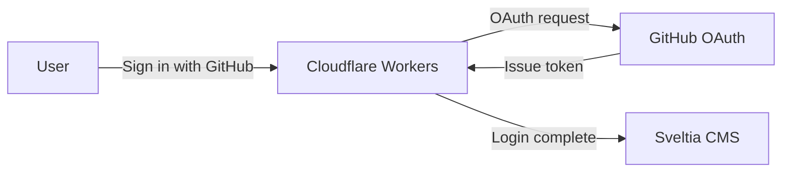

## Scribbles,,,

I just needed a space to jot things down.

Nothing grandiose. I wanted to organize what I studied somewhere and have a place to revisit later. I considered Tistory and briefly looked at Velog, but then I thought building one myself could be a learning experience too. So I went with a GitHub blog.

When I searched for ways to build one, there were so many options out there. Jekyll, Hugo, Gatsby, Astro... Too many choices actually made it harder to decide, but in the end I went with Next.js + GitHub Pages since that's what I'm most familiar with. Familiar is best.

It took a few days to finish the blog, and honestly the process wasn't smooth at all. Things I thought would work didn't, and things I thought wouldn't work somehow did. Here's a record of all that trial and error.

***

## Tech Stack

| Category | Technology | Version |
| --- | --- | --- |
| Framework | Next.js | 16.2.1 |
| Language | TypeScript | 5.x |
| UI Library | React | 19.2.4 |
| Styling | Tailwind CSS | 4.x |
| Typography | @tailwindcss/typography | 0.5.19 |
| Markdown | remark + remark-gfm + remark-html + gray-matter | - |
| Reading Time | reading-time | 1.5.0 |
| CMS | Sveltia CMS | CDN |
| OAuth Proxy | Cloudflare Workers (Sveltia CMS Authenticator) | - |
| Hosting | GitHub Pages | - |
| CI/CD | GitHub Actions | - |

***

## Framework: Next.js

I created the project with `create-next-app` and set it up with the App Router. Since a blog doesn't need a dynamic server, I configured `output: "export"` in `next.config.ts` to build it as a static site.

Markdown files live in the `posts/` directory. `gray-matter` parses the frontmatter (title, date, tags), and `remark` + `remark-gfm` + `remark-html` converts the body to HTML. `remark-gfm` supports GitHub Flavored Markdown so it can render tables, strikethrough, etc. The `reading-time` library calculates the estimated reading time.

Page routing uses `generateStaticParams()` to pre-generate all post and tag pages at build time. After deployment, everything runs on static HTML alone with no separate server.

***

## Styling: Tailwind CSS + Typography

I used Tailwind CSS 4.x for styling. For the markdown body, I applied the `prose` class from the `@tailwindcss/typography` plugin to get clean body rendering without custom styles.

The fonts are Space Grotesk (body) and JetBrains Mono (code), with a rose-toned accent color. Dark mode was set as the default from the start. I switched from `prefers-color-scheme` to directly applying a `dark` class on the html element. Using `@custom-variant` for class-based dark mode turned out to be cleaner in Tailwind CSS 4.

***

## Hosting: GitHub Pages

The reason for choosing GitHub Pages is simple. It's free, integrates naturally with a GitHub repository, and auto-deploys with GitHub Actions on every push.

### The basePath Problem

This is where the first round of trouble began. After deploying to GitHub Pages, **CSS and JS didn't load at all.** The page opened but it was a blank slate with no styles applied.

The cause was GitHub Pages' URL structure. Since the repo name was `minsnote.github.io`, the site was deployed under `https://jinwonmin.github.io/minsnote.github.io/`, but Next.js looks for assets at the root (`/`) by default.

I fixed it by adding `basePath` and `assetPrefix` to `next.config.ts`.

```typescript
const nextConfig: NextConfig = {
  output: "export",
  basePath: "/minsnote.github.io",
  assetPrefix: "/minsnote.github.io/",
  images: { unoptimized: true },
};
```

It's a simple config, but if you don't know about it, you can waste a lot of time.

***

## CMS: From Decap CMS to Sveltia CMS

Creating markdown files locally and committing them every time I want to write a blog post is tedious. I wanted a CMS that lets me write directly in the browser, and I initially chose **Decap CMS** (formerly Netlify CMS).

### Decap CMS Authentication Hell

Setting up Decap CMS itself was quick. You just put `index.html` and `config.yml` in `public/admin/`. The problem was **GitHub OAuth authentication**.

Decap CMS requires a separate OAuth proxy server for GitHub login. I first tried using Netlify as the OAuth proxy, but clicking "Sign in with GitHub" just showed **404 Not Found** in the popup.

After that, I spent about an hour trying the following approaches in order:

1. **Netlify OAuth proxy** -- 404 error. The `site_domain` config was wrong
2. **GitHub PKCE auth** (`auth_type: pkce`) -- Also failed. Decap CMS's PKCE support was unstable
3. **Explicit `site_domain` setting** -- Still fell back to Netlify auth
4. **Netlify `site_domain` reconfiguration** -- Partially worked but wasn't stable

### Switching to Sveltia CMS

I gave up on Decap CMS and switched to **Sveltia CMS**. Sveltia CMS is a drop-in replacement for Decap CMS -- you just swap out one CDN script.

But Sveltia CMS also needed an **OAuth client server** for GitHub OAuth. I deployed the official **Sveltia CMS Authenticator** to Cloudflare Workers, registered a GitHub OAuth App, and added `base_url` to `config.yml`. Finally, authentication worked.

The final auth flow looks like this:



Looking back, I would've saved time if I'd gone with Sveltia CMS + Cloudflare Workers from the start. Decap CMS is quite tricky to set up OAuth for outside of a Netlify environment.

Here's the actual editing screen in Sveltia CMS. You write markdown on the left and see a live preview on the right.


***

## CI/CD: GitHub Actions

The deployment pipeline is set up with GitHub Actions. It automatically builds and deploys to GitHub Pages on every push to the `main` branch.

```yaml
# .github/workflows/deploy.yml
jobs:
  build:
    steps:
      - npm ci
      - npm run build        # → generates static files in ./out/
      - upload-pages-artifact # → uploads to GitHub Pages
  deploy:
    - deploy-pages           # → deploy
```

When you write a post in the CMS, it creates a commit on GitHub, which automatically triggers build and deploy. You can write and publish posts from the browser without doing anything locally.

***

## Project Structure

```plain
├── src/
│   ├── app/                    # Next.js App Router
│   │   ├── layout.tsx          # Root layout (Header + Footer)
│   │   ├── page.tsx            # Homepage
│   │   ├── posts/[slug]/       # Post detail page
│   │   ├── tags/               # Tag list / filter by tag
│   │   └── about/              # About page
│   ├── components/             # UI components
│   │   ├── Header.tsx          # Top navigation
│   │   ├── Sidebar.tsx         # Sidebar layout
│   │   ├── ProfileCard.tsx     # Profile card
│   │   ├── PostCard.tsx        # Post list card
│   │   ├── TagNav.tsx          # Tag filter (client)
│   │   ├── TableOfContents.tsx # Table of contents (Intersection Observer)
│   │   └── HomeContent.tsx     # Home content (client)
│   └── lib/
│       ├── posts.ts            # Markdown parsing and post data
│       └── formatDate.ts       # Korean date formatting
├── posts/                      # Markdown post files
├── public/admin/               # Sveltia CMS
└── .github/workflows/          # GitHub Actions deployment
```

***

## Summary

| Problem | Solution |
| --- | --- |
| Asset loading failure on static site | `basePath` + `assetPrefix` config |
| Markdown body styling | `@tailwindcss/typography` prose class |
| Dark mode as default | `dark` class on html + `@custom-variant` |
| Markdown table not rendering | Added `remark-gfm` plugin |
| Missing URL preview on link share | `metadataBase` + `openGraph` config |
| Decap CMS OAuth failure | Switched to Sveltia CMS + Cloudflare Workers |
| CMS post writing to auto deploy | Sveltia CMS -> GitHub commit -> Actions -> Pages |

Most of the trouble came from "GitHub Pages sub-path deployment" and "CMS authentication." The CMS authentication in particular was hard to solve with just the official docs -- I had to try multiple approaches to find the right combination.

***

## URL Preview Issue When Sharing Links

When sharing blog links, the URL preview only showed the domain (`jinwonmin.github.io`) instead of the full path. The cause was that Next.js's `metadataBase` wasn't set, so the Open Graph meta tag (`og:url`) wasn't being generated properly.

I fixed it by adding `metadataBase` and `openGraph` settings to the metadata in `layout.tsx`.

```typescript
export const metadata: Metadata = {
  metadataBase: new URL("https://jinwonmin.github.io/minsnote.github.io"),
  openGraph: {
    type: "website",
    siteName: "minsnote",
    locale: "ko_KR",
  },
};
```

Just like the `basePath` issue, when deploying to a GitHub Pages sub-path, you have to pay attention to every URL-related setting.
