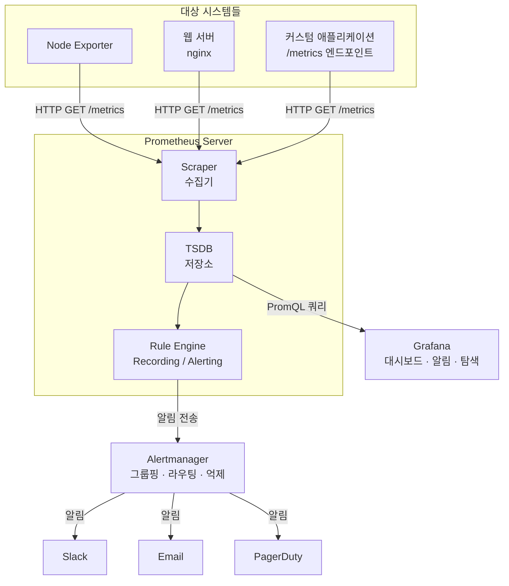

> **참고**: 이 글은 Prometheus (v3.2.1)와 Grafana 공식 문서를 기반으로 요약·정리한 내용입니다. 정확한 내용은 공식 문서를 참조해 주세요.
> - [Prometheus 공식 문서](https://prometheus.io/docs/)
> - [Grafana 공식 문서](https://grafana.com/docs/grafana/latest/)

***

## 2.1 Prometheus 컴포넌트

Prometheus 생태계는 여러 개의 독립적인 컴포넌트로 구성되며, 대부분 Go 언어로 작성되어 정적 바이너리로 배포된다.

### Prometheus Server

시스템의 핵심 컴포넌트다. 세 가지 주요 역할을 수행한다.

1. **Scraping (수집)**: 설정된 대상(targets)에서 HTTP를 통해 메트릭을 가져온다
2. **Storage (저장)**: 수집된 메트릭을 로컬 시계열 데이터베이스(TSDB)에 저장한다
3. **Querying (조회)**: PromQL을 통해 저장된 데이터를 조회하고 분석한다

추가로 규칙 평가(Recording Rules, Alerting Rules)를 주기적으로 수행하며, 알림 조건이 충족되면 Alertmanager로 알림을 전송한다.

기본 포트: **9090**

### Alertmanager

Prometheus Server가 보낸 알림을 수신하여 처리하는 컴포넌트다. 단순히 알림을 전달하는 것이 아니라, 다음과 같은 고급 기능을 제공한다.

- **그룹핑 (Grouping)**: 유사한 알림을 하나의 알림으로 묶는다. 예를 들어, 100개의 서버가 동시에 다운되면 100개의 개별 알림 대신 하나의 그룹 알림을 보낸다.
- **억제 (Inhibition)**: 상위 알림이 발생하면 하위 알림을 자동으로 무음 처리한다. 네트워크 장애로 모든 서비스가 다운되면, 개별 서비스 다운 알림을 억제한다.
- **무음 (Silences)**: 특정 기간 동안 특정 알림을 비활성화한다. 계획된 유지보수 중에 불필요한 알림을 방지한다.
- **라우팅 (Routing)**: 레이블 기반으로 알림을 적절한 수신자에게 전달한다.

기본 포트: **9093**

### Push Gateway

짧은 생명 주기(short-lived)의 배치 작업(batch job)을 위한 중간 저장소다.

Prometheus의 Pull 모델에서는 대상 시스템이 항상 실행 중이어야 스크래핑이 가능하다. 하지만 배치 작업은 실행 후 즉시 종료되므로 스크래핑할 기회가 없다. Push Gateway는 이 문제를 해결한다.

```plain
[Batch Job] --push--> [Push Gateway] <--scrape-- [Prometheus]
```

배치 작업이 완료되면 Push Gateway에 결과를 전송(push)하고, Prometheus는 Push Gateway를 주기적으로 스크래핑한다.

기본 포트: **9091**

> **주의**: Push Gateway는 배치 작업 전용이다. 일반 서비스의 메트릭 수집에 사용하면 안 된다. 공식 문서에서 이를 명확히 경고한다.

### Client Libraries (클라이언트 라이브러리)

애플리케이션 코드에 직접 메트릭을 추가(계측, instrumentation)할 때 사용하는 라이브러리다.

**공식 지원 언어:**

| 언어 | 라이브러리 |
| --- | --- |
| Go | `prometheus/client_golang` |
| Java/Scala | `prometheus/client_java` |
| Python | `prometheus/client_python` |
| Ruby | `prometheus/client_ruby` |
| Rust | `prometheus/client_rust` |
| .NET | `prometheus-net` |

이 라이브러리를 사용하면 애플리케이션이 `/metrics` 엔드포인트를 노출하여 Prometheus가 스크래핑할 수 있게 된다.

### Exporters (익스포터)

이미 존재하는 시스템에서 Prometheus 형식의 메트릭을 제공하는 어댑터다. 직접 코드를 수정할 수 없는 서드파티 시스템(데이터베이스, 웹 서버, 하드웨어 등)을 모니터링할 때 사용한다.

**주요 Exporter:**

| Exporter | 대상 | 기본 포트 |
| --- | --- | --- |
| Node Exporter | Linux 호스트 (CPU, 메모리, 디스크, 네트워크) | 9100 |
| Blackbox Exporter | HTTP/TCP/DNS 엔드포인트 가용성 | 9115 |
| MySQL Exporter | MySQL 서버 | 9104 |
| PostgreSQL Exporter | PostgreSQL 서버 | 9187 |
| cAdvisor | Docker 컨테이너 | 8080 |
| JMX Exporter | JVM 애플리케이션 (Kafka, Cassandra 등) | 설정 가능 |

***

## 2.2 Pull 모델 vs Push 모델

### Pull 모델 (Prometheus 방식)

Prometheus는 대상 시스템에 HTTP 요청을 보내 메트릭을 가져오는 Pull 모델을 사용한다.

```plain
[Prometheus Server] --HTTP GET /metrics--> [Target Application]
```

**장점:**

- **대상 상태 확인**: 스크래핑 자체가 헬스 체크다. 스크래핑에 실패하면 `up` 메트릭이 0이 되어 대상이 다운됐음을 알 수 있다.
- **중앙 집중 제어**: 무엇을 얼마나 자주 수집할지 Prometheus 서버에서 결정한다.
- **개발 편의성**: 개발 환경에서 로컬 브라우저로 `/metrics` 엔드포인트에 접근하여 메트릭을 직접 확인할 수 있다.
- **방화벽 친화적**: 모니터링 서버에서 대상으로 나가는 연결만 필요하다.

**단점:**

- 대상이 항상 접근 가능해야 한다 (NAT 뒤의 시스템은 어렵다)
- 배치 작업처럼 짧은 생명 주기의 대상에는 Push Gateway가 필요하다

### Push 모델 (전통적 방식)

StatsD, Graphite 등의 시스템은 대상이 메트릭을 모니터링 서버로 전송하는 Push 모델을 사용한다.

```plain
[Target Application] --push--> [Monitoring Server]
```

**장점:**

- 방화벽/NAT 뒤의 시스템도 모니터링 가능
- 짧은 생명 주기의 작업에 자연스러움

**단점:**

- 대상 다운 시 즉각 감지가 어려움 (메트릭이 안 오는 것인지, 보내지 않는 것인지 구분 불가)
- 대상이 모니터링 서버의 주소를 알아야 함

### 어떤 모델이 더 나은가?

정답은 없다. 하지만 Prometheus의 Pull 모델은 특히 **동적 환경(Kubernetes, 클라우드)** 에서 강점이 있다. 서비스 디스커버리와 결합하면 새로운 인스턴스가 뜨거나 내려갈 때 자동으로 스크래핑 대상이 조정되기 때문이다.

***

## 2.3 Grafana의 역할: 시각화 + 알림 + 탐색

Grafana는 단순한 대시보드 도구가 아니다. 세 가지 핵심 역할을 수행한다.

### 시각화 (Visualization)

다양한 데이터소스의 데이터를 시각적으로 표현한다.

- **25종 이상의 시각화 유형**: Time Series, Stat, Gauge, Bar Chart, Table, Heatmap, Histogram, Pie Chart, Node Graph, Geomap 등
- **동적 대시보드**: 템플릿 변수를 사용하여 드롭다운 선택에 따라 대시보드가 동적으로 변경
- **Annotations**: 배포, 인시던트 등의 이벤트를 대시보드에 표시
- **Data Links**: 차트에서 클릭 시 다른 대시보드나 외부 시스템으로 연결

### 알림 (Alerting)

Grafana 자체 알림 시스템을 제공한다 (Prometheus Alertmanager와는 독립적).

- **Grafana 관리 알림 규칙**: 쿼리 + 조건 + 임계값으로 정의
- **Contact Points**: Slack, Email, PagerDuty, Webhook, Discord, Telegram 등
- **Notification Policies**: 트리 구조의 라우팅 규칙
- **Mute Timings**: 시간대별 알림 비활성화

### 탐색 (Explore)

대시보드를 만들지 않고 즉석에서 쿼리를 실행하고 결과를 확인하는 기능이다.

- 장애 상황에서 빠르게 데이터를 조회
- 대시보드 작성 전 쿼리를 테스트
- 로그와 메트릭을 함께 탐색

***

## 2.4 전체 데이터 흐름도

Prometheus + Grafana 생태계의 전체 데이터 흐름은 다음과 같다.



### 데이터 흐름 요약

1. **수집**: Prometheus가 설정된 간격(기본 15초~1분)으로 대상 시스템의 `/metrics` 엔드포인트를 스크래핑
2. **저장**: 수집된 메트릭을 로컬 TSDB에 타임스탬프와 함께 저장
3. **규칙 평가**: Recording Rules로 자주 사용되는 쿼리를 사전 계산하고, Alerting Rules로 알림 조건을 평가
4. **시각화**: Grafana가 PromQL을 사용하여 Prometheus에 쿼리하고, 결과를 대시보드에 렌더링
5. **알림**: 조건 충족 시 Alertmanager가 그룹핑, 라우팅을 거쳐 Slack, Email 등으로 알림 전송

***

## 2.5 Prometheus가 적합한/부적합한 사용 사례

### 적합한 사용 사례

Prometheus 공식 문서에서 명시하는 적합한 환경은 다음과 같다.

**순수 숫자 기반 시계열 기록:**

- CPU 사용률, 메모리 사용량, 디스크 I/O, 네트워크 트래픽 등 인프라 메트릭
- HTTP 요청 수, 에러율, 응답 지연시간 등 애플리케이션 메트릭

**기계 중심(machine-centric) 모니터링:**

- 서버, 컨테이너, 네트워크 장비 등의 상태 모니터링

**동적 마이크로서비스 아키텍처:**

- Kubernetes 환경에서 Pod가 동적으로 생성/삭제되는 환경
- 서비스 디스커버리와의 연동으로 대상을 자동 탐지

**신뢰성이 중요한 진단 시스템:**

- Prometheus의 각 서버 노드는 독립적으로 동작한다. 네트워크 파티션이나 다른 인프라 장애 시에도 모니터링이 계속 동작한다.
- 장애 진단을 위한 시스템이 장애에 의존적이면 안 된다는 원칙을 잘 지킨다.

### 부적합한 사용 사례

**100% 데이터 정확도가 요구되는 경우:**

- 요청 단위 과금(per-request billing)
- 금융 거래 정산
- 법적 감사(audit) 목적의 기록

이러한 사용 사례에서는 메트릭이 아닌 정확한 이벤트 로깅 시스템(예: 관계형 데이터베이스, 이벤트 스트리밍 플랫폼)을 사용해야 한다.

**텍스트 기반 이벤트 분석:**

- 로그 분석에는 Loki나 Elasticsearch가 적합하다
- Prometheus는 숫자 데이터만 저장한다

**장기 보관(long-term storage):**

- 기본 리텐션은 15일이며, 로컬 스토리지는 확장에 한계가 있다
- 장기 보관이 필요하면 Thanos, Cortex 등의 원격 스토리지 솔루션을 고려해야 한다
